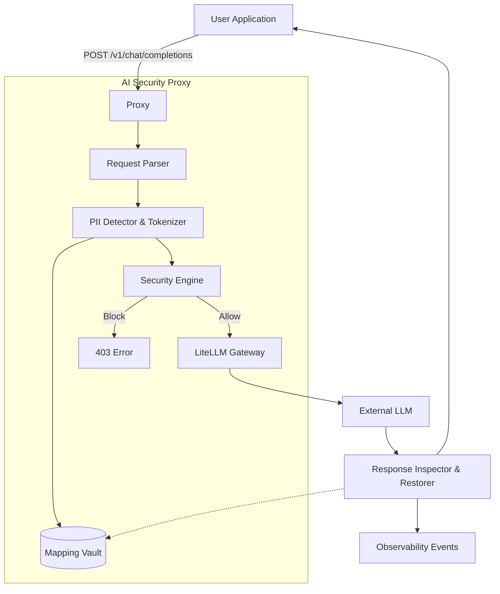

# AI Security & Observability Proxy

This is an open-source AI Security & Observability Proxy for enterprise LLM deployments.
It sits between your user application and an external LLM, protecting sensitive information before it leaves a trusted environment via Dynamic Canary Tokenization (reversible pseudonymization), detecting prompt injection, enforcing policies, and providing a clean dashboard for observability.

## Features
- **OpenAI-Compatible FastAPI Proxy**: Drop-in replacement for OpenAI endpoints.
- **Privacy Engine**: Deterministic Regex and Format Validation (Aadhaar, PAN, etc.) combined with Gemma 4 contextual detection.
- **Dynamic Canary Tokenization**: Replaces PII with request-scoped mapping vault tokens (e.g. `<PERSON_A81F2C>`) and restores them in the LLM response.
- **Security Engine**: Prompt injection detection and policy enforcement.
- **Observability Dashboard**: Streamlit dashboard showing real-time security events, total requests, blocks, and PII detected.

## Architecture


## Tech Stack
- **Backend**: Python 3.11, FastAPI, Pydantic, LiteLLM
- **Privacy/ML**: Regex, Gemma 4 (via transformers/torch)
- **Frontend/Observability**: Streamlit, SQLite

## Setup Instructions
### Docker (Recommended)
```bash
docker-compose up --build
```
This starts the proxy on port `8000` and the dashboard on port `8501`.

### Local Execution (No Docker)
```bash
python -m venv .venv
source .venv/bin/activate  # or .venv\Scripts\activate on Windows
pip install -r requirements.txt

# Terminal 1: Proxy
uvicorn app.main:app --reload --port 8000

# Terminal 2: Dashboard
streamlit run dashboard/app.py
```

## Environment Variables
- `APP_NAME`: Name of proxy.
- `LLM_PROVIDER`: `mock` | `openai` | `gemini` | `ollama`
- `MOCK_LLM`: `true` | `false`
- `OPENAI_API_KEY`: API Key for OpenAI.
- `GEMINI_API_KEY`: API Key for Google Gemini.
- `POLICY_PII_ACTION`: `allow` | `block` | `redact`
- `OBSERVABILITY_DB_URL`: SQLite connection string.

### Configuring Gemma 4
To use Gemma 4 for contextual detection, set:
```env
GEMMA_ENABLED=true
GEMMA_MODEL_PATH=google/gemma-4b
GEMMA_DEVICE=auto
```

### Configuring External LLM
To point the proxy to OpenAI, update your `.env`:
```env
LLM_PROVIDER=openai
MOCK_LLM=false
OPENAI_API_KEY=sk-...
```

## Usage
Simply point your existing OpenAI SDK to the proxy:
```python
import openai

client = openai.OpenAI(
    base_url="http://localhost:8000/v1",
    api_key="proxy-key" # API key not required for local proxy testing
)

response = client.chat.completions.create(
    model="demo-model",
    messages=[{"role": "user", "content": "My Aadhaar is 1234 5678 9012"}]
)
print(response.choices[0].message.content)
```

## Testing
Run the automated test suite:
```bash
PYTHONPATH=. pytest tests/
```

## Security Assumptions & Known Limitations
- **In-memory vault**: Mappings are currently held in memory. In a multi-worker production environment, this requires a Redis adapter.
- **Regex Limitations**: Regex alone may produce false positives/negatives. Gemma 4 provides contextual fallback but requires compute.
- **LLM Hallucinations**: If the LLM generates tokens that were not in the prompt, the restorer safely ignores them.

## Future Improvements
- Redis mapping vault for horizontal scaling.
- Async parallelization of security modules.
- Deeper custom policy builder UI.
